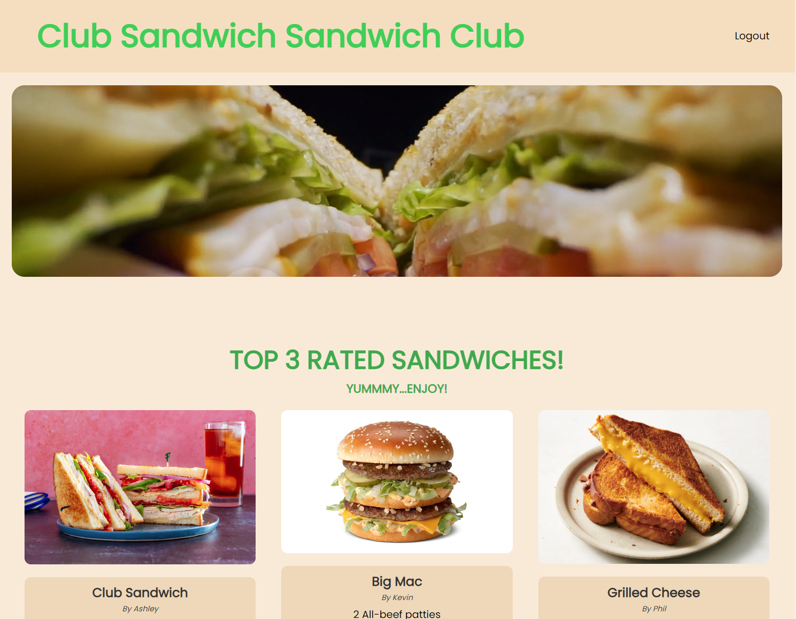

# Club Sandwich Sandwich Club

## Description

Create, share and rate your favorite sandwiches!  This project is a simple RESTful API built with Node.js and Express.js, using Handlebars.js for templating, MySQL for the database, and Sequelize for ORM. It includes both GET and POST routes for retrieving and adding data.

## Table of Contents

- [Installation](#installation)
- [Usage](#usage)
- [Contributors](#contributors)
- [Other Credits](#credits)
- [License](#license)
- [Questions](#questions)

## Installation

[Club Sandwich Sandwich Club Deployed Application](https://club-sandwich-sandwich-club-ddb63265b5d8.herokuapp.com/)

## Usage

* Login or sign up if you have not created an account yet
* The top 3 sandwiches are shown on the home page.  Click on one to see more info on it.
* If you created the sandwich, you will be taken to the sandwich editor where you can update the ingredients and/or image link
* If it was created by someone else, you can see its ingredients and give it a rating by clicking on the stars
* Not what you're looking for? Click on "See more" to see a complete list of sandwiches
* Or, type in the name of the sandwich in the search input
* Click on "Add your own" to create your own sandwich
* Input your ingredients and click submit to add your own creations to the web site

## Contributors
* Kevin Hogan ([Kevin's Portfolio Site](https://kevinhogansprofile.netlify.app/))
* Phil Sloan ([Phil's Github Repo](https://github.com/philsloan))
* Ashley Paluzzi ([Ashley's Github Repo](https://github.com/ASHLOUISE))
* Manny Singh ([Manny's Github Repo](https://github.com/mandeepiscoding))

## Other Credits

* Node.js Copyright [OpenJS Foundation](https://openjsf.org/) and Node.js contributors. All rights reserved.
* Bcrypt Copyright © 2010 Nicholas Campbell
* Express Copyright © 2009-2014 TJ Holowaychuk <tj@vision-media.ca>,
Copyright © 2013-2014 Roman Shtylman <shtylman+expressjs@gmail.com>,
Copyright © 2014-2015 Douglas Christopher Wilson <doug@somethingdoug.com>
* Dotenv Copyright © 2015, Scott Motte. All rights reserved.
* Express-session Copyright © 2010 Sencha Inc.
Copyright © 2011 TJ Holowaychuk <tj@vision-media.ca>
Copyright © 2014-2015 Douglas Christopher Wilson <doug@somethingdoug.com>
* Mysql2 Copyright © 2016 Andrey Sidorov (sidorares@yandex.ru) and contributors
* Sequelize Copyright © 2014-present Sequelize Authors

## License

This application is covered under the MIT License.

## Questions

[GitHub Repository](https://github.com/philsloan/Club-Sandwich-Sandwich-Club)

For questions, please contact [Phil Sloan](https://github.com/philsloan), [Ashley Paluzzi](mailto:paluzziashley@gmail.com), [Manny Singh](https://www.linkedin.com/in/mandeepiscoding/), or [Kevin Hogan](kchogan@pacbell.net).
